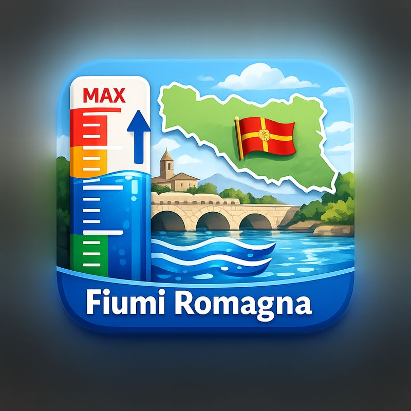

# MCP Fiumi Romagna

MCP server that retrieves river level data from the official Allerta Emilia-Romagna APIs.



## Requirements
- Node.js 18+ (for the JS MCP and HTTP server)
- Python 3.10+ (for the FastMCP Python server)

## Install
```
npm install
```

## Run (Node MCP)
```
npm start
```

## Run (Python FastMCP)
```
python3 -m pip install fastmcp
python3 src/streams.py
```

## HTTP server (for GPT Actions)
Expose the HTTP API locally:
```
npm run start:http
```

Endpoints:
- `GET /livello-idrometrico?fiume=Ronco`
- `GET /stazioni?filtro=Savio&max_results=20`
- `GET /health`

## GPT Store (Actions) setup
1) Deploy the HTTP server to a public HTTPS URL (Render/Fly/Railway/your VPS).
2) Set `servers[0].url` in `openapi.yaml` to your public base URL.
3) In the GPT Builder, add an Action and upload `openapi.yaml`.
4) Test calls inside the GPT Builder and publish your GPT.

## MCP configuration (stdio)
Example configuration (Node MCP):
```
{
  "mcpServers": {
    "fiumi-romagna": {
      "command": "node",
      "args": ["/Users/marcodalprato/GitHub/mcp_fiumi_romagna/src/index.js"]
    }
  }
}
```

Example configuration (Python FastMCP):
```
{
  "mcpServers": {
    "fiumi-romagna": {
      "command": "python3",
      "args": ["/Users/marcodalprato/GitHub/mcp_fiumi_romagna/src/streams.py"]
    }
  }
}
```

## OpenAI retrieval (file search)
The MCP can use OpenAI file search to improve matching when a station name is misspelled
or incomplete. This follows the OpenAI retrieval guide and works for both the JS
and Python servers.

Setup:
1) Set `OPENAI_API_KEY`.
2) Run `npm run retrieval:setup` to create a vector store from the latest station list.
3) Copy the printed `Vector store ID` into `OPENAI_VECTOR_STORE_ID`.

Optional environment variables:
- `OPENAI_MODEL` (default: `gpt-4.1-mini`)
- `OPENAI_BASE_URL` (override if you use a proxy)
- `OPENAI_VECTOR_STORE_NAME` (default: `mcp-fiumi-romagna`)
- `OPENAI_BETA` (set if your OpenAI account requires beta headers)

## Available tools
- `livello_idrometrico`
  - Input: `{ "fiume": "Ronco", "max_results": 3 }`
  - Output: river level data for stations matching the river or station name.

- `elenco_stazioni_idrometriche`
  - Input: `{ "filtro": "Savio", "max_results": 20 }`
  - Output: list of available hydrometric stations (optionally filtered).

## Notes
- Data source: `https://allertameteo.regione.emilia-romagna.it/o/api/allerta/get-sensor-values-no-time` with idrometric variable `254,0,0/1,-,-,-/B13215`.
- If no station matches the provided name, the tool returns close station suggestions.
